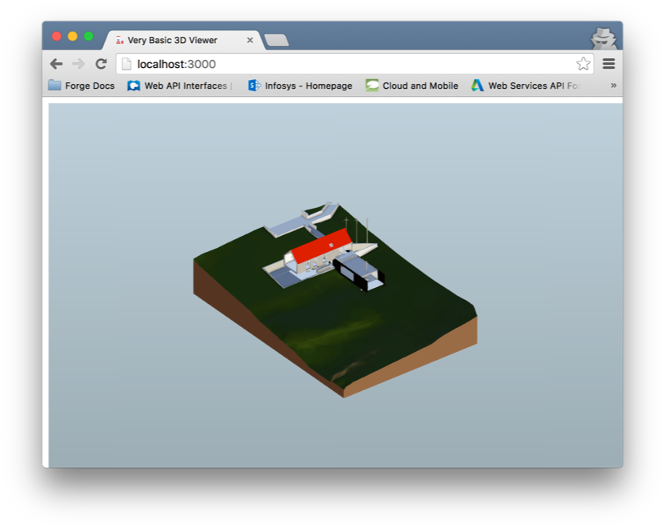

# Forge Viewer Classroom Trainning
Step 3: With Token API

<<<<<<< HEAD
Based on Step 2 that we just type the access token, we will use your client_id and client_secret to get the
access token.

## Setup
- Register an app, upload a file and get the urn.
- Replace the client_id, client_secret in credentials_.js, and also urn in index.js with your own.
- Run "Node server.js" in command line to start the website
- Go to localhost:3000 with your browser!

=======
This the the minimal JavaScript needed to get a <b>Viewer</b> running, in only about 10 lines of code!

## Setup
- Go through steps in http://shiya.github.io/Intro-View-and-Data/ to get your token, upload a file and get the urn.
- Replace the token and urn with your own.
- To run on local server with a Mac, go to the directory of where you save this file with terminal and type `$ python -m SimpleHTTPServer`
- Go to localhost:8000 with your browser!
>>>>>>> Developer-Autodesk/master

Afterwards, you should see your model displayed in your browser:

## Written By
Zhong Wu (Forge Partner Development)
